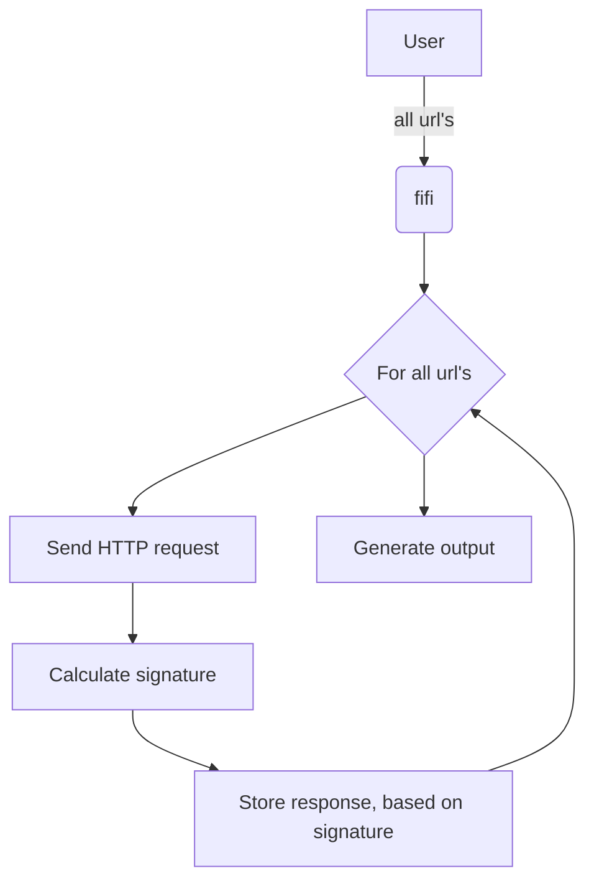

# fifi

fifi sends to a given list of url's HTTP requests, calculates on each response a signature and groups them based on the values.

Responses with the same signature may indicate similar implementation pattern, technologies and homogenious data processing. 

## Background

Recently, spring boot had a wide spreaded RCE vulnerability, known as [Spring4Shell](https://portswigger.net/daily-swig/spring4shell-microsoft-cisa-warn-of-limited-in-the-wild-exploitation) ([CVE-2022-22965](https://cve.mitre.org/cgi-bin/cvename.cgi?name=CVE-2022-22965)). Due to the fact that modern web application are implemented based on micro service pattern, various paths of a domain may end up on different applications/containers/CDN. To limit the attack surface system administrator, DevOps Engineers and SRE's are highly interested in limiting the available information about a service in the public.

This tool provides help to identify differences in the response headers from a given list of urls.

## Installation
Ether download it from [the release page](https://github.com/NodyHub/fifi/releases) or complie it by yourself:
```
go install github.com/NodyHub/fifi@v0.2.0
```

## Usage and example output

```shell
[~/git/fifi]% fifi -h
2022/04/29 16:30:36 usage: fifi [files]
Parse urls and fetch Server banners.

Options:
[files] provide the urls in files.
  -C	Crash on error
  -H string
    	Host
  -X string
    	Method (default "GET")
  -a string
    	Authorization
  -c string
    	Cookie
  -j	Result as json
  -m int
    	Maximum retries for request (default 3)
  -p	Perform requests in parallel
  -r	Include HTTP response code in signature calculation
  -s	Include 'Server' response header in signature calculation
  -t int
    	Timeout seconds (default 1)
  -u string
    	User-Agent (default GoLang default)
  -v	Verbose output
  -w int
    	Wait ms between requests
[~/git/fifi]% cat uber.url.lst | fifi -v -p
2022/04/29 16:30:38 reading from stdin...
2022/04/29 16:30:38 Collected 11 different urls, starting analysis
2022/04/29 16:30:38 232310904 https://auth.uber.com/
2022/04/29 16:30:38 3022560216 https://auth.uber.com/login/social/
2022/04/29 16:30:38 1149410124 https://auth.uber.com/login/session
2022/04/29 16:30:38 1149410124 https://auth.uber.com/login/
2022/04/29 16:30:39 3022560216 https://auth.uber.com/login/social
2022/04/29 16:30:39 1149410124 https://auth.uber.com/login/?breeze_local_zone=dca11&next_url=https%3A%2F%2Fm.uber.com%2F&state=NUUybaiHU9SIaKz56QjyvtJTz5CJC25zhhyocPV9guM%3D
2022/04/29 16:30:39 1149410124 https://auth.uber.com/login/social/?next_url=https%3A%2F%2Fm.uber.com%2F&privileged_op_url=https%3A%2F%2Fm.uber.com%2F&uber_client_name=m2
2022/04/29 16:30:39 1149410124 https://auth.uber.com/login/?next_url=https%3A%2F%2Fm.uber.com%2F&privileged_op_url=https%3A%2F%2Fm.uber.com%2F
2022/04/29 16:30:39 1149410124 https://auth.uber.com/login/?breeze_local_zone=dca1&state=0A-OdN1vuv_FDbpofRZqJg9maKASCY4k0kCRVEiSDGw%3D&uber_client_name=riderSignUp&uclick_id=840a8ddd-ac10-47e6-aec4-e492968acc42
2022/04/29 16:30:39 1149410124 https://auth.uber.com/login
2022/04/29 16:30:39 1149410124 https://auth.uber.com/login/social/?from=facebook&state=%7B%22query%22%3A%22%3Fnext_url%3Dhttps%253A%252F%252Fm.uber.com%252F%26privileged_op_url%3Dhttps%253A%252F%252Fm.uber.com%252F%26uber_client_name%3Dm2%22%2C%22csrfToken%22%3A%221650443852-01-FNOsAwdU4I8HWkiFZuimbrTHjauX146ik_Hq9h7k1Ew%22%2C%22app%22%3A%22%22%7D&response_type=token

Summary:
===================================
Headers received in every response:
===================================
 - Server
 - X-Content-Type-Options
 - X-Frame-Options
 - X-Uber-Edge
 - Content-Type
 - Date
 - Vary
 - Via
 - Strict-Transport-Security
 - X-Envoy-Upstream-Service-Time
 - Alt-Svc
 - Cache-Control
 - X-Xss-Protection
===================================

-----------------------------------
Signature: 1149410124 ; URLs: 8
Additional headers:
 - Content-Security-Policy
 - Etag
 - Set-Cookie
 - Set-Cookie
 - Timing-Allow-Origin
 - X-Content-Security-Policy
 - X-Csrf-Token
 - X-Webkit-Csp

Urls:
[200] https://auth.uber.com/login
[200] https://auth.uber.com/login/
[200] https://auth.uber.com/login/?breeze_local_zone=dca1&state=0A-OdN1vuv_FDbpofRZqJg9maKASCY4k0kCRVEiSDGw%3D&uber_client_name=riderSignUp&uclick_id=840a8ddd-ac10-47e6-aec4-e492968acc42
[200] https://auth.uber.com/login/?breeze_local_zone=dca11&next_url=https%3A%2F%2Fm.uber.com%2F&state=NUUybaiHU9SIaKz56QjyvtJTz5CJC25zhhyocPV9guM%3D
[200] https://auth.uber.com/login/?next_url=https%3A%2F%2Fm.uber.com%2F&privileged_op_url=https%3A%2F%2Fm.uber.com%2F
[200] https://auth.uber.com/login/session
[200] https://auth.uber.com/login/social/?from=facebook&state=%7B%22query%22%3A%22%3Fnext_url%3Dhttps%253A%252F%252Fm.uber.com%252F%26privileged_op_url%3Dhttps%253A%252F%252Fm.uber.com%252F%26uber_client_name%3Dm2%22%2C%22csrfToken%22%3A%221650443852-01-FNOsAwdU4I8HWkiFZuimbrTHjauX146ik_Hq9h7k1Ew%22%2C%22app%22%3A%22%22%7D&response_type=token
[200] https://auth.uber.com/login/social/?next_url=https%3A%2F%2Fm.uber.com%2F&privileged_op_url=https%3A%2F%2Fm.uber.com%2F&uber_client_name=m2
-----------------------------------

-----------------------------------
Signature: 232310904 ; URLs: 1
Additional headers:

Urls:
[404] https://auth.uber.com/
-----------------------------------

-----------------------------------
Signature: 3022560216 ; URLs: 2
Additional headers:
 - Content-Security-Policy
 - Etag
 - Set-Cookie
 - Set-Cookie
 - X-Content-Security-Policy
 - X-Csrf-Token
 - X-Webkit-Csp

Urls:
[404] https://auth.uber.com/login/social
[404] https://auth.uber.com/login/social/
-----------------------------------

```

# Application behaviour




# Similar or related projects

* https://github.com/rverton/wonitor
* https://github.com/dgtlmoon/changedetection.io
